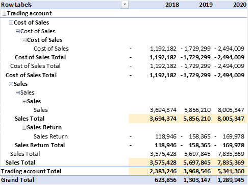
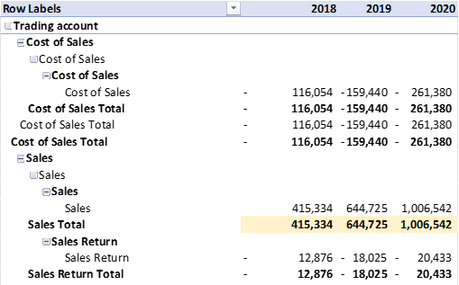
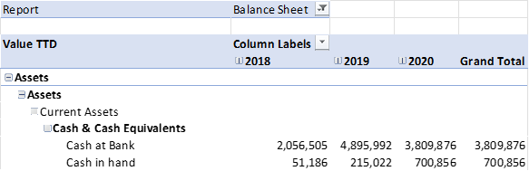
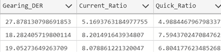

# Financial Reporting and Analysis System using SQL

## Project Description

**Overview :**  
The project aims to develop a comprehensive financial reporting and analysis system using SQL (Structured Query Language). The system utilizes five key datasets: general ledger, charts of accounts, territory, calendar, and cash flow. By leveraging these datasets, the system generates essential financial reports including Profit and Loss (P&L) statements, Balance Sheets, and Cash Flow statements.

## Project Goal

Design SQL queries to generate accurate and timely financial reports including Profit and Loss statements, Balance Sheets, and Cash Flow statements.

## Tools and Library Used

## Project Result

[Click here to get full code](./SQLQuery_finance.sql)

### A. Profit and Loss Statement

**Create pivot table report of profit and loss for 2018,2019,2020**  

**If we compare SQL Query to Excel result**  

**Create pivot table report of profit and loss for 2018,2019,2020 for country France**  

**If we compare SQL Query to Excel result for France only**  

**Calculating Profit and Loss Statement Related Values**  

**If we compare SQL Query to Excel Profit and Loss Statement Related Values**  

### B. Balance Sheet

**Create pivot table report of balance sheet for 2018,2019,2020**  

**If we compare SQL Query to Excel result**  

**Calculating Balance Sheet Related Values**  

**If we compare SQL Query to Balance Sheet Excel result**

### C. Calculating Ratios

  
  
  
 
### D. Cash Flow Statement    
**Calculating Cash Flow Related Values**  
  
   
**If we compare SQL Query to Cash Flow Excel result**

## About the Developer

**Mohit Shyam Amode**  
Data Analyst

Mohit is a professional Data Analyst with over 4 years of experience in SQL, dashboard development, and structured data analysis. He specializes in query optimization, reporting workflows, and translating complex operational requirements into actionable financial insights. This project serves as a demonstration of his expertise in financial data modeling and SQL-based reporting systems.

**Contact and Professional Profiles:**
- Email: mohitshyamamode@gmail.com
- LinkedIn: linkedin.com/in/mohitamode
- Technical Skills: SQL, Python, R, JavaScript, C, C++, R Shiny, Streamlit, LangChain